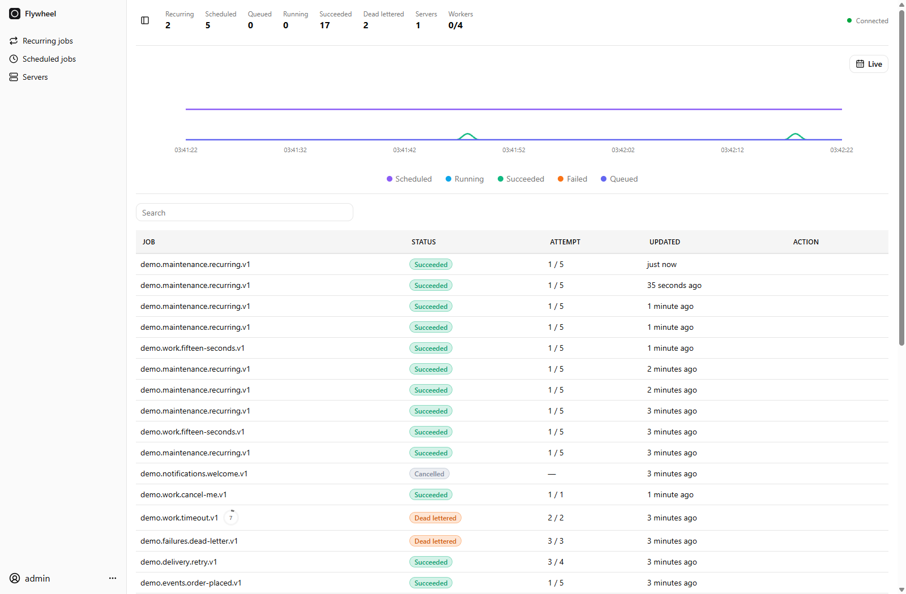
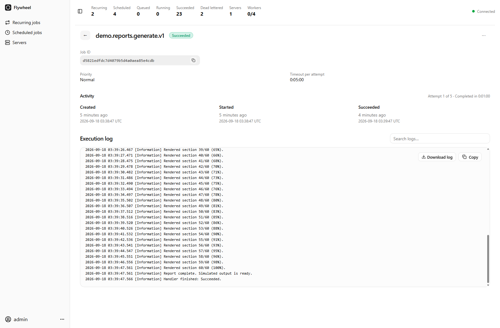

[](https://www.nuget.org/packages/Soenneker.Flywheel.Dashboard/)
[](https://github.com/soenneker/soenneker.flywheel.suite/actions/workflows/publish-package.yml)
[](https://www.nuget.org/packages/Soenneker.Flywheel.Dashboard/)
[](https://github.com/soenneker/soenneker.flywheel.suite/actions/workflows/build-and-test.yml)
[](https://github.com/soenneker/soenneker.flywheel.suite/actions/workflows/codeql.yml)

# Soenneker.Flywheel.Dashboard

Blazor WebAssembly dashboard for Flywheel. Search jobs, view status and live logs, and cancel work.

**From the queue to the full execution story.**

See activity as it happens, find the job that needs attention, and read the logs your handlers already write.

[](https://flywheel.soenneker.com)

### Follow every attempt

Open an execution to inspect its state, attempts, timing, and captured `ILogger` output.

[](https://flywheel.soenneker.com)

*Screenshots use isolated, illustrative demo data.*

[Explore Flywheel](https://flywheel.soenneker.com) · [Run the demo](../test/Soenneker.Flywheel.Demo/README.md)

## Setup

Start with the [runnable demo](../test/Soenneker.Flywheel.Demo/README.md).

For your own Blazor WebAssembly app, install `Soenneker.Flywheel.Dashboard` and serve it with the Flywheel API over HTTPS. The [sample server](../test/Soenneker.Flywheel.Demo/Program.cs) shows authentication and API setup. Configure a dashboard password PHC string on the server.

## Usage

Register the dashboard in the WebAssembly host's `Program.cs`:

```csharp
using Soenneker.Flywheel.Dashboard.Registrars;

builder.Services.AddScoped(_ => new HttpClient
{
    BaseAddress = new Uri(builder.HostEnvironment.BaseAddress)
});
builder.Services.AddFlywheelDashboardAsScoped();
```

For a separately hosted backend, register its base URL instead. This configures the dashboard HTTP client
and all SignalR connections to use that backend and include browser cookies:

```csharp
builder.Services.AddFlywheelDashboardAsScoped(
    new Uri("https://localhost:7002/"), options => options.HomePath = "/");
```

The backend must allow the dashboard's exact origin with credentialed CORS. Its authentication cookies
must also be valid for the deployment's site relationship; different HTTPS localhost ports are same-site
but cross-origin. This overload replaces the separate host HTTP-client registration shown above.

Use `FlywheelRouter` in the host's `App.razor`. It resolves the configured dashboard paths and passes the page and route parameters to Blazor's `RouteView`. Each page uses `FlywheelLayout`, which renders the shared navigation and header around `@Body` and remains mounted while navigating between dashboard pages.

```razor
@using Soenneker.Flywheel.Dashboard

<FlywheelRouter>
    <NotFound Context="path">
        <p role="alert">Page not found.</p>
    </NotFound>
</FlywheelRouter>
```

The optional `NotFound` fragment receives the base-relative path without a query string or fragment. Render host pages there using explicit conditions and concrete components. Host pages are not discovered from assemblies; configuring `HomePath = "/"` gives Flywheel ownership of the root. No outer shell component is needed.

See the [WebAssembly demo](../test/Soenneker.Flywheel.Dashboard.Demo) for Quark/Tailwind styles and the complete host setup.

## Communication and component lifetime

Dashboard pages use `LeptonCancellable` and call `IFlywheelDashboardConsumer`, which follows the
`Soenneker.Blazor.Consumers.Core` pattern and returns `OperationResult<T>`. The Flywheel API-client
implementation owns cookie credentials, antiforgery tokens, request creation, and backend-origin checks.
It is registered as `IFlywheelApiClient`, so it does not replace a host application's bearer-token API client.

With the Redis provider, a hosted recorder saves running, scheduled, and queued counts every second,
independently of dashboard connections. Opening or reopening the dashboard loads the last minute of
these samples alongside success and failure events. Each sample expires as soon as its second falls outside the live window (at most 61 seconds); a newly
started recorder needs one minute to accumulate a full window. Missing server samples remain unknown.

`IFlywheelLiveClient` owns SignalR setup. The layout owns the shared board connection and authentication
lifetime. The overview page changes its execution query; recurring and scheduled pages consume schedule
snapshots without loading the overview chart or executions. Navigation preserves the connection and header
counters. Execution details and log components own their additional subscriptions and dispose them when closed.

Overview, recurring jobs, scheduled jobs, and sign-in are separate pages with their own state and content.
The sign-in page handles credentials; the layout redirects unauthenticated visitors there before mounting
protected page content. Pages receive typed snapshots and call consumers rather than constructing HTTP
requests, hub URLs, or protocol method names.

HTTP responses and SignalR interfaces live in `Soenneker.Flywheel.Communication`, a dependency-free
contracts package published from the Core repository. Core's snapshot factory maps storage records
to these contracts without exposing payloads or lease credentials. Existing response types moved
from `Soenneker.Flywheel.Dashboard.Responses` to `Soenneker.Flywheel.Communication.Responses`.

## Pages and navigation

| Route | Content |
|---|---|
| `/flywheel` | Activity and job search |
| `/signin` | Sign in, then return to the configured home page |
| `/flywheel/recurring` | Recurring schedules and Run now |
| `/flywheel/recurring/{ScheduleId}` | Recurring schedule details and Run now |
| `/flywheel/scheduled` | Pending jobs and retries |
| `/jobs/{JobId}` | Job details and logs |
| `/flywheel/servers` | Active servers |
| `/flywheel/servers/{ServerId}` | Server details |

Page files are grouped by feature under `Pages`: `Schedules/Schedules.razor` and `Schedules/Schedule.razor`,
`Jobs/Jobs.razor` and `Jobs/Job.razor`, and `Servers/Servers.razor` and `Servers/Server.razor`.
The overview and sign-in pages live in `Dashboard` and `Authentication`; shared page behavior lives in `Shared`.
The singular schedule and job pages also supply the detail content for their list drawers.

The default home path is `/flywheel`. To serve the dashboard at `/`, configure the WebAssembly host:

```csharp
builder.Services.AddFlywheelDashboardAsScoped(options => options.HomePath = "/");
```

Signed-out visitors are redirected to `/signin`; successful sign-in returns to `/`. Signed-in visitors to `/signin` also return home. Sign-out goes directly to `/signin`.

With `FlywheelRouter`, this serves the dashboard at `/` without a host-owned `Index.razor`. Remove an old root dashboard wrapper or redirect page when migrating. With the default `HomePath = "/flywheel"`, `/` is passed to your `NotFound` fragment so you can render your own homepage explicitly.

Remove any server-side `app.MapGet("/", ... Results.Redirect("/flywheel"))` mapping so the existing `MapFallbackToFile("index.html")` serves the root page. Home links and sign-in redirects use the configured home path. The built-in `/flywheel` page, recurring and scheduled pages, job detail routes, and `/flywheel` API and hub endpoints keep their existing paths.

Updates use SignalR. Job logs come from `ILogger<T>` and are visible to signed-in dashboard users.

See [Core usage](core.md#usage) to define and enqueue jobs.
